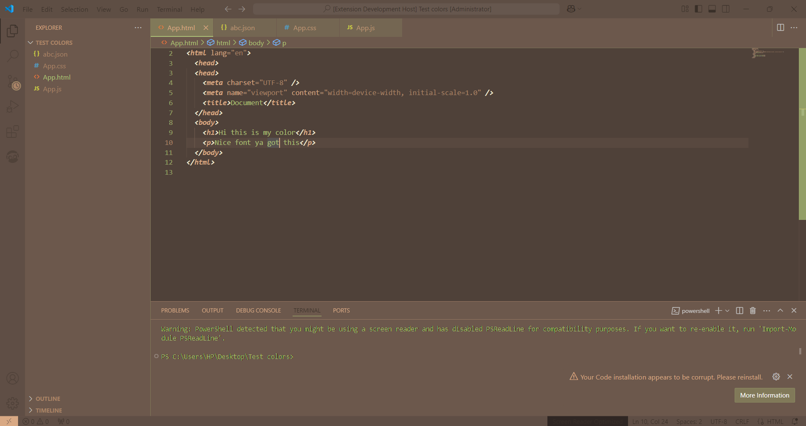

# Coffee Bean Theme ☕🌿

A soothing, minimal, and eye-friendly theme inspired by the rich hues of coffee beans. Perfect for developers who code better with a warm, inviting atmosphere!

---

## **Features**

- **Warm Coffee-Inspired Colors** ☕  
  Gentle browns and greens for a calming effect, ideal for long coding sessions.

- **Minimal and Aesthetic Design** 🎨 
  Simple yet elegant, with easy-to-read fonts.

- **Focused Environment** 🔍 
  Perfect contrast to keep your focus intact.

---

## **Installation**

1. Clone or download the theme repository.
2. Add the theme files (`.json`, `.css`, etc.) to your code editor.
3. Activate the Coffee Bean Theme in your editor's settings.
4. Enjoy coding in a warm and cozy atmosphere! 🌟

---

## **Preview**

---

## **Why Coffee Bean Theme?**

- Coding can be intense, and harsh themes strain your eyes. Coffee Bean Theme is **designed to relax your eyes** without compromising readability.
- It’s not just a theme; it’s an **experience of coding with comfort**. 🌱

---

## **Connect**

🌐 Git : [Git Repo Link] (https://github.com/KOWSIK-M/coffee-bean-theme)
💌 Email: [Your Email](2200030358@gmail.com)
📱 Follow me on [LinkedIn](https://www.linkedin.com/in/medam-kowsik-975479282/) for updates!

---

## **License**

MIT License. Free to use and modify. 😊
